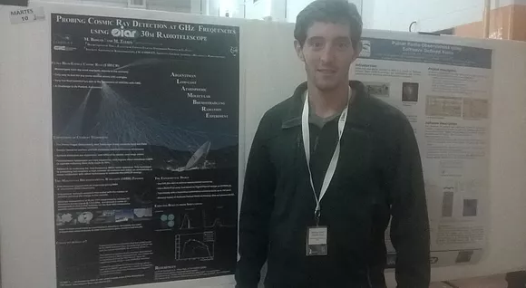

Responsible for the development of a library which could determine the possibility of radio emission detections from extensive air showers induced by cosmic rays: 

- Simulating the **High Energy Cosmic Rays** using the [AIRES](http://aires.fisica.unlp.edu.ar/index.html) software.
- Simulating the 30m radio telescope located in the **Argentine Institute of Radio Astronomy** [IAR](https://www.iar.unlp.edu.ar/). 
- Develop Monte Carlo simulations to quantify sensitivity and the detection efficiency of a radio telescope under several possible configurations.
- This work was presented at the 100th Annual meeting of the **Argentine Physics Association** from 22 to 25 of September 2015 held in Villa de Merlo, San Luis, Argentina. Project titled: *Probing Cosmic Ray Detection at GHz Frequencies using IAR 30m Telescope*. More info [here](https://www.fisica.org.ar/wp-content/blogs.dir/33/files/sites/33/2019/02/resumen_rafa_2015.pdf) (page 87).

### Document

<object data="./Detección_en_radio_de_rayos_cosmicos.pdf" type="application/pdf" width="700px" height="700px">
    <embed src="./Detección_en_radio_de_rayos_cosmicos.pdf">
        
This browser does not support PDFs. Please download the PDF to view it: <a href="./Detección_en_radio_de_rayos_cosmicos.pdf">Download PDF</a>.

    </embed>
</object>

### Presentation

Recently, radio detection has been proposed as one of the most promising techniques to instrument the next generation
of UHECR observatories. This technique would exploit the GHz radio emission of the air ionized by the passage of the
UHECR cascade to track the longitudinal development of the cascade in the atmosphere. A successful implementation of
this technique would allow the estimation of the UHECR energy and incoming direction as it is currently done with the UV
fluorescence technique used in the Pierre Auger Observatory but with the advantage of having nearly a 100 % duty cycle
and little dependence on atmospheric condition.

Laboratory measurements of the radio emission originating from an ionized air plasma left by the passage of a high
energy electron beam, indicated that a UHECR cascade would emit enough radiation in the GHz frequency range to be
detectable by system with a small (2-5m) dish antenna and commercial ‘off the shelf’electronics. Unfortunately, none of the
experimental efforts conducted for its detection on the field has been successful, rising doubts on either the interpretation
of the accelerator measurements or on the scaling employed to go from laboratory conditions to a real UHECR cascade.

We propose to use the IAR 30m radio-telescope to search for signals compatible with UHECR cascades with unprecedented sensitivity, in order to determine the intensity of the radio emission from particle cascades or at least set an upper
limit. In this article we show the sensitivity to UHECR cascades and event rate that a 4 pixel detector mounted in the
antenna focus would have.

<object data="./ALAMBRE_POSTER_AFA.pdf" type="application/pdf" width="700px" height="700px">
    <embed src="./ALAMBRE_POSTER_AFA.pdf">
        
This browser does not support PDFs. Please download the PDF to view it: <a href="./ALAMBRE_POSTER_AFA.pdf">Download PDF</a>.

    </embed>
</object>

