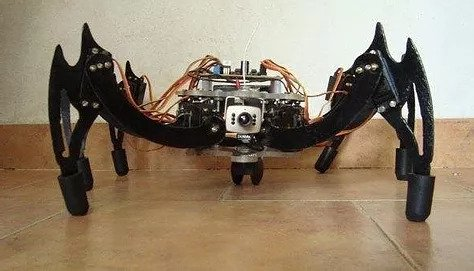

This six-legged robot consists of 18 servo-motors controlled by a central processor. This project was coded using [Basic](https://en.wikipedia.org/wiki/BASIC).

<iframe width="560" height="315" src="https://www.youtube.com/embed/PJFWH32YFsI" title="YouTube video player" frameborder="0" allow="accelerometer; autoplay; clipboard-write; encrypted-media; gyroscope; picture-in-picture" allowfullscreen></iframe>

