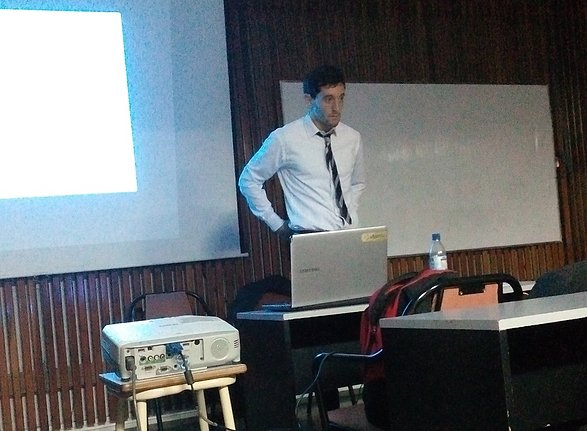

Fore more information, visit the GitHub repository

### Study of phase transitions of an Ising-type model with spin oriented dependent interaction parameters

<object data="https://docs.google.com/viewer?url=https://github.com/mattborghi/Thesis/raw/main/TesisFinal.pdf&embedded=true" type="application/pdf" width="700px" height="700px">
    <iframe src="https://docs.google.com/viewer?url=https://github.com/mattborghi/Thesis/raw/main/TesisFinal.pdf&embedded=true"></iframe>
</object>

### Presentation

<object data="https://docs.google.com/viewer?url=https://github.com/mattborghi/Thesis/raw/main/Presentaci%C3%B3n.pdf&embedded=true" type="application/pdf" width="700px" height="700px">
    <iframe src="https://docs.google.com/viewer?url=https://github.com/mattborghi/Thesis/raw/main/Presentaci%C3%B3n.pdf&embedded=true"></iframe>
</object>

### Tech Stack

- [Fortran](https://fortran-lang.org/)
- [LaTeX](https://www.latex-project.org/)
- [Gnuplot](http://www.gnuplot.info/)
- [R](https://www.r-project.org/)
- [Mathematica](https://www.wolfram.com/mathematica/)
- [C++](https://isocpp.org/)
- [Python](https://www.python.org/)